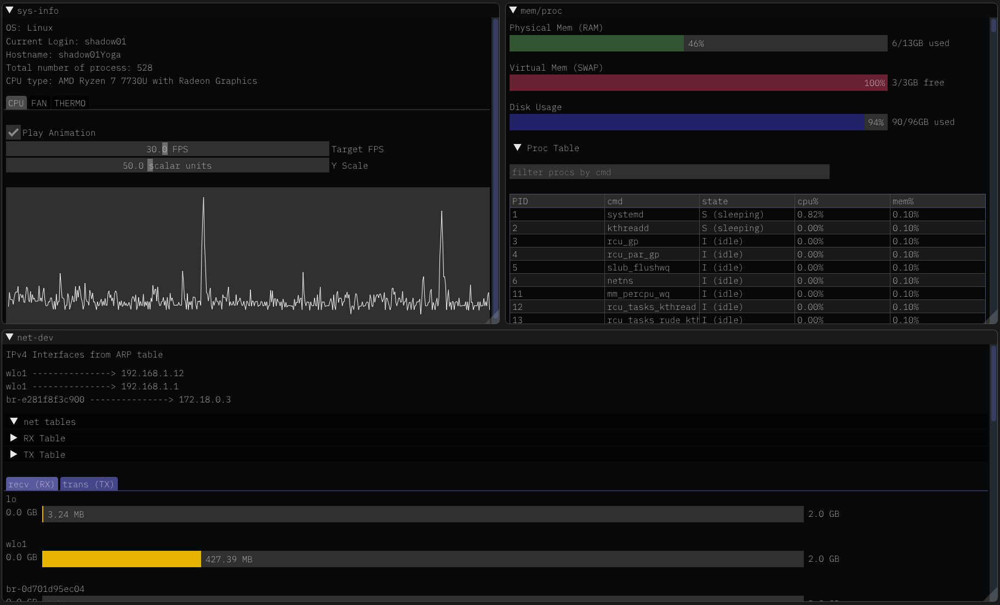

# `sys-dog`


  

`sys-dog` is a comprehensive system status tracker for Debian-based systems. It monitors system parameters, memory and disk information, tracks all processes on the system, and accounts for every single byte received or sent by your NIC!



## Features

- **Written in C++ with Dear ImGui**: Ensuring a robust, lightweight and an efficient system monitor.
- **Designed for Debian-based Systems**: Tailored to work seamlessly with Ubuntu and other Debian-based distributions.
- **No Extra Dependencies**: Utilizes native system commands, `procfs`, and `sysfs` to gather necessary parameters, eliminating the need for additional installations.

> Note: `sys-dog` may not work on macOS or Windows systems without native implementations for these platforms. Contributions are welcome to extend compatibility!

## Getting Started

### Prerequisites

- `g++`: Latest Version
- `make`
- `sdl2`

### Installation

1. **Clone this Repository**

   ```bash
   git clone https://github.com/akhaled01/sys-dog.git
   ```

2. **Build the Project**:

   Navigate to the root directory and run the following command:

   ```bash
   make
   ```

3. **Run the Monitor**:

   Execute the monitor:

   ```bash
   ./monitor
   ```

> Coming to apt soon!

## Contributing

We welcome contributions to make `sys-dog` better! Here are a few ways you can help:

- Implement compatibility for macOS or Windows systems.
- Suggest or add new features.
- Add the required code to read fan data.
- Improve the existing codebase.

Feel free to fork the project and submit pull requests.

### Author

Project written by Abdulrahman Idrees (akhaled01).
